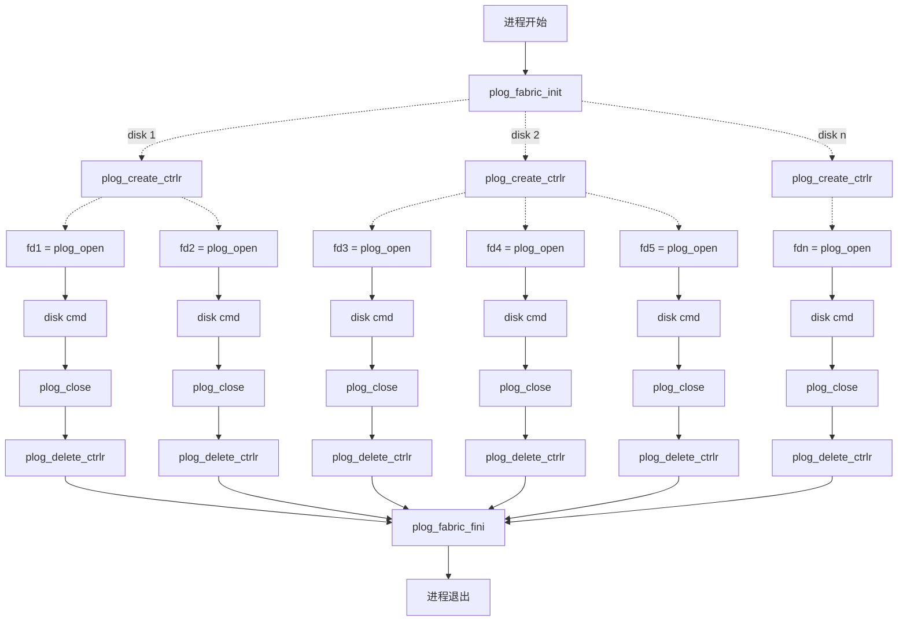

# API
API提供的库为libplog_fabric.so、libplog_fabric_init.so，其依赖的库已存放在lib目录下，但需要注意的是，如果lib下有提供的库，必须使用lib下的库，否则可能导致进程无法运行，例如ssl、crypto等。

## 宏定义
~~~
#define PLOG_TRADDR_MAX_LEN 256
#define PLOG_TRSVCID_MAX_LEN 32
#define PLOG_ESN_LEN 20
#define PLOG_TRSTRING_MAX_LEN 32
#define PLOG_NQN_MAX_LEN 223

#define PLOG_INVALID_IP "Invalid IP"
#define PLOG_DEFAULT_NS 0xFFFFFFFF /* 默认nsid */
#define PLOG_INVALID_NS 0xFFFFFFFE /* 非法nsid */

/* 错误码 */
#define PLOG_RETURN_OK (0)
#define PLOG_RETURN_ERR (-1)
#define PLOG_RETURN_BUSY (-2)
#define PLOG_CTRLR_EXIST (-10)
#define PLOG_NO_SUCHCTRLR (-11)
#define PLOG_CTRLR_NOTOK (-12)
#define PLOG_NO_SUCHNS (-13)
#define PLOG_TIME_OUT (-14)
~~~

## 枚举值
### enum plog_adrfam
原型
~~~
enum plog_adrfam {
    PLOG_ADRFAM_IPV4 = 0x1,        /* * IPv4 (AF_INET) */
    PLOG_ADRFAM_IPV6 = 0x2,        /* * IPv6 (AF_INET6) */
    PLOG_ADRFAM_IB = 0x3,          /* * InfiniBand (AF_IB) */
    PLOG_ADRFAM_FC = 0x4,          /* * Fibre Channel address family */
    PLOG_ADRFAM_INTRA_HOST = 0xfe, /* * Intra-host transport (loopback) */
};
~~~

描述
~~~
struct plog_disk协议簇
~~~

### enum plog_rw_opt
原型
~~~
enum plog_rw_opt {
    PLOG_RW_OPT_APPEND = 1,     /* append */
    PLOG_RW_OPT_VOID_APPEND,    /* void append */
    PLOG_RW_OPT_REALIGN_APPEND, /* realign append */
    PLOG_RW_OPT_REPAIR_APPEND,  /* repair append */
    PLOG_RW_OPT_READ,           /* read */
    PLOG_RW_OPT_BUTT,
}; 
~~~

描述
~~~
plog io读写操作类型
~~~

## 数据结构
### struct plog_disk
原型
~~~
typedef struct plog_disk {
    enum plog_adrfam adrfam;                /* 协议簇 */
    char traddr[PLOG_TRADDR_MAX_LEN + 1];   /* IP地址，本地盘请填PLOG_INVALID_IP  */
    char trsvcid[PLOG_TRSVCID_MAX_LEN + 1]; /* 网络端口号 或者 本地PCIe BDF */
    char esn[PLOG_ESN_LEN + 1];             /* 盘的sn号 */
    uint32_t nsid;                          /* namespace id */
    uint64_t dst_nid;                       /* tgt远端nid */
} plog_disk_t;
~~~

描述
~~~
plog盘描述信息
~~~

### struct plog_io_ctx
原型
~~~
/* *****************************************************************************************
函数名：plog_callback_func
功能：注册的plog io完成回调函数
参数：
status_code：io 状态码， 0为成功，负值为系统错误码，正值为NVMe标准协议status code错误码
code_type：  io 状态码类型，为NVMe标准协议status code type
           （0： GENERIC； 1：COMMAND_SPECIFIC；2： MEDIA_DATA_INTERGRITY_ERROR； 7：VENDOR_SPECIFIC）
cb_arg：  回调函数的入参
返回值：无
****************************************************************************************** */
typedef void (*plog_usercb_func)(int status_code, int code_type, void *cb_arg);

typedef struct plog_io_ctx {
    plog_usercb_func cb;
    void *cb_arg;
    uint32_t timeout_ms; /* 单位:毫秒，不能为0，建议12 * 1000(12s) */
} plog_io_ctx_t;
~~~

描述
~~~
异步命令的上下文信息
~~~

### struct plog_param
原型
~~~
typedef struct plog_param {
    uint64_t plog_id;   /* PLOG ID */
    uint16_t access_id; /* 用于访问权限控制，如果不需要权限检测，可通过SQE的PVF位进行控制 */
    uint32_t pg_version; /* 当前IO携带的PG版本号，需要与PLOG对应的版本号进行对比，如果版本号不一致，则返回IO失败 */
} plog_param_t;
~~~

描述
~~~
plog描述信息，只需设置plog_id即可
~~~

### struct plog_attr_table
原型
~~~
/* 注意协议，元素顺序不能调整 */
#pragma pack(1)
typedef struct plog_attr_table {
    uint8_t plog_id[8];    /* PLOG ID，8Byte */
    uint16_t namespace_id; /* Namespace ID */
    uint8_t plog_type;     /* PLOG 类型:
                            *    00 : 通用 PLOG
                            *    01 : 特殊 PLOG
                            * Other : 保留
                            */
    uint8_t plog_state;    /* Bit 4—7 is Reserved
                            * Bit 0—3:PLOG State：
                            *     00h：Opened
                            *     01h：Sealed
                            *     02h: Published
                            *     03h：Deleted
                            *   Other：保留.
                            */
    uint8_t band_id;       /* 加密盘指定当前PLOG绑定到Band ID */
    uint8_t stream_id;     /* 流ID，支持8路流, 有效范围1—8表示有效流ID */
    uint16_t create_size;  /* 标识这个PLOG可能量级，单位：M byte */
    uint32_t written_size; /* PLOG当前写指针的位置, 单位：Read/Append Minimum Granularity */
    uint32_t pg_id; /* PG ID: 当前PLOG归属的PLOG group,分布式场景下的概念。如果不需要检测号，可通过SQE的PVF位进行控制
                     *    Byte 39    : 预留
                     *    Byte 36-38 : 用于表示PG ID值
                     */
    uint16_t	
        cap_usage_threshold; /* 盘容量使用百分比，在创建时在每个PLOG属性上指定单盘容量使用的百分比值，
                              * 如果容量达到指定的水线后，后面针对相应PLOG的写操作需要返回失败，精度百分比小数点后两位
                              */
    uint8_t reserved1[17];     /* 保留 */
    uint8_t seal_reason;       /* 主机自定义字段，盘测与驱动不感知，盘仅保存 */
    uint32_t seal_size;        /* 主机自定义字段，盘测与驱动不感知，盘仅保存 */
    uint8_t user_plog_id[16];  /* 主机自定义字段，盘测与驱动不感知，盘仅保存 */
    uint8_t parallel;          /* 主机自定义字段，盘测与驱动不感知，盘仅保存 */
    uint8_t user_state;        /* 主机自定义字段，盘测与驱动不感知，盘仅保存 */
    uint32_t user_type;        /* 主机自定义字段，盘测与驱动不感知，盘仅保存 */
    uint16_t member_id;        /* 主机自定义字段，盘测与驱动不感知，盘仅保存 */
    uint16_t service_id;       /* 主机自定义字段，盘测与驱动不感知，盘仅保存 */
    uint8_t timestamp_info[8]; /* 主机自定义字段，盘测与驱动不感知，盘仅保存 */
    uint8_t reserved2[14];     /* 保留 */
    uint8_t app_spec[92];      /* 主机自定义字段，盘测与驱动不感知，盘仅保存 */
    uint8_t reserved3[68];     /* 保留 */
} plog_attr_table_t;
#pragma pack()
~~~

描述
~~~
plog属性信息
~~~

### struct plog_rw_param
原型
~~~
typedef struct plog_rw_param {
    enum plog_rw_opt opt;    /* 读写操作类型 */
    plog_param_t plog_param; /* PLOG 信息 */
    uint32_t offset; /* 请求在PLOG逻辑空间的偏移位置, 按Read/Append Minimum Granularity对齐，单位：Read/Append Minimum Granularity */
    uint32_t length; /* 请求写入数据长度，本字段采用0 base value，按Read/Append Minimum Granularity对齐，                        单位：Read/Append Minimum Granularity，协议能力访问最大范围为1M Bytes */
    uint8_t limit_retry; /* 1 : 控制器应用有限的重试努力。0 : 控制器应用所有可用的错误恢复方法，将数据写入NVM */
    uint8_t dif_check;   /* 默认校验 */
} plog_rw_param_t;
~~~

描述
~~~
读写命令参数
~~~

### struct sgl_vector
原型
~~~
typedef struct {
    char *buf;      /* 页面数据起始地址，需要物理连续 */
    void *pageCtrl; /* 页面控制头地址 */
    uint32_t len;   /* 有效数据长度，单位为byte */
    uint32_t pad;
} plog_sgl_entry_s;

#define ENTRY_PER_SGL 64

struct list_head {
    struct list_head *next, *prev;
};

typedef struct plog_sgl_s {
    struct plog_sgl_s *nextSgl; /* 下一个sgl指针，用于组成sgl链 */
    uint16_t entrySumInChain;   /* sgl链中sgl_entry总数，该字段自在sgl链第一个sgl中有效 */
    uint16_t entrySumInSgl;     /* 本sgl中sgl_entry数据 */
    uint32_t flag;              /* 数据标记，用于标识该sgl中是否包含零页面、bst页面等 */
    uint64_t serialNum;         /* sgl序列号*/
    plog_sgl_entry_s entrys[ENTRY_PER_SGL]; /* sgl_entry数组*/
    struct list_head stSglNode;
    uint32_t cpuid; /* 保存申请该结构体时的cpu */
} plog_sgl;

typedef struct sgl_vector {
    uint32_t cnt;              /* sgl链数量 */
    struct plog_sgl_s *sgls[]; /* sgls memory size is enqual to cnt*sizeof(struct plog_sgl*), which is malloced by user
                                */
} sgl_vector_t;
~~~

描述
~~~
读写sgl的描述信息
~~~

## API
### API调用流程
    plog_fabric api调用流程如下图所示，首先调用plog_fabric_init完成内存及模块初始化，完成初始化后即可对每一个盘调用plog_create_ctrlr创建ctrlr，创建ctrlr完成后可多次调用plog_open打开文件句柄，每次打开的文件句柄全局唯一。后续对盘的操作（如plog_create、plog_append、plog_read、plog_get_attr等）均通过此句柄来完成。对盘的操作完成后每一个调用plog_open的文件句柄都需要调用一次plog_close关闭句柄。进程退出之前需调用plog_fabric_fini释放相关资源。

### plog_fabric_init
原型
~~~
int plog_fabric_init();
~~~
描述
~~~
内存及模块初始化。
~~~

### plog_fabric_fini
原型
~~~
void plog_fabric_fini();
~~~
描述
~~~
plog_fabric退出处理。
~~~

### plog_create_ctrlr
原型
~~~
int plog_create_ctrlr(struct plog_disk *pdisk, struct plog_io_ctx *ctx);
~~~
描述
~~~
功能说明: 创建设备：
    本地盘：只允许在盘接入的时候创建一次，要与plog_delete_dev配对使用
    远端盘：每个盘允许创建一次，如果当前没有建立PLOG连接，则发起建立PLOG连接
参数：
    plog_disk：包含盘所在的IP、端口号和esn等信息
    ctx:命令上下文，包含IO完成回调函数callback,和参数,超时时间（可以一直等待）
返回值：
    PLOG_RETURN_OK -设备创建成功，调用者需要匹配使用plog_delete_dev
    PLOG_CTRLR_EXIST -设备已经存在错误码，调用者不需要匹配使用plog_delete_dev
    PLOG_RETURN_ERR -设备创建失败，调用者不需要匹配使用plog_delete_dev
返回方式：异步
超时：超时后可重入，返回特定错误码。
~~~

### plog_delete_ctrlr
原型
~~~
void plog_delete_ctrlr(struct plog_disk *pdisk);
~~~
描述
~~~
功能说明：在本地盘out或者远端链路断开时，删除设备
参数： plog_disk：包含盘所在的IP、端口号
返回方式：同步
~~~

### plog_open
原型
~~~
int plog_open(struct plog_disk *pdisk);
~~~
描述
~~~
功能说明：打开设备上的指定盘，返回盘操作句柄fd， fd和盘的namespace id绑定；
参数：plog_disk：包含盘所在的IP、端口号和esn
返回值：
    fd -成功返回盘对象的fd，使用fd可以对盘进行读写等操作，需要匹配使用plog_close
    PLOG_NO_SUCHCTRLR -没有找到对应的ctrlr设备，不需要匹配使用plog_close
    PLOG_CTRLR_NOTOK -ctrlr设备的状态不对（init/offline），不需要匹配使用plog_close
    PLOG_NO_SUCHNS –没有找到对应的namespace，不需要匹配使用plog_close
提示：
返回方式：同步返回
多次open：每open一次，返回一个不同的操作句柄fd，调用plog_open之前需先调用plog_create_ctrlr，否则会返回PLOG_NO_SUCHCTRLR错误。
~~~

### plog_close
原型
~~~
void plog_close(int fd);
~~~
描述
~~~
函数名：plog_close
功能：关闭指定设备对象的盘
参数：fd：指定盘的句柄
同步异步：同步返回
~~~

### plog_create
原型
~~~
int plog_create(int fd, struct plog_param *pinfo, struct plog_attr_table *plog_attr, struct plog_io_ctx *ctx);
~~~
描述
~~~
函数名：plog_create
功能：在指定盘上创建plog
参数：
  fd:指定盘的句柄
  pinfo：plog的信息，主要包括plog id
  plog_attr：创建plog的参数，注意包括创建的plog的大小create_size
  ctx：命令上下文，包含IO完成回调函数callback,和参数,超时时间
返回值：0-成功，非0-失败
返回方式：异步
提示：数据内存使用系统内存，物理地址可能不连续，驱动做一次拷贝
~~~

### plog_append_sgl
原型
~~~
int plog_append_sgl(int fd, struct plog_rw_param *param, sgl_vector_t *sgl, struct plog_io_ctx *ctx);
~~~
描述
~~~
函数名： plog_append_sgl
功能：在指定盘上执行写操作，数据格式为sgl
参数：
  fd:指定盘的句柄
  param：param参数,包括操作类型、offset、length等。offset、length需要Read/Append Minimum Granularity对齐，单位为Read/Append Minimum Granularity，当前盘Read/Append Minimum Granularity为16字节。需要注意的是，如果offset是通过plog_get_attr接口获取得到的（plog_attr-> written_size），同样需要整除Read/Append Minimum Granularity，plog_get_attr获取的written_size单位为字节。
  sgl：存放读写数据的sgl，内存由client申请和释放。sgl中的entrys中的元素的buf所指向的地址即为读写数据的地址，需要物理连续，可调用rte_malloc申请。
  ctx：命令上下文，包含IO完成回调函数callback
返回方式：异步
返回值：0-成功，非0-失败
~~~

### plog_read_sgl
原型
~~~
int plog_read_sgl(int fd, struct plog_rw_param *param, sgl_vector_t *sgl, struct plog_io_ctx *ctx);
~~~
描述
~~~
函数名： plog_read_sgl
功能：在指定盘上执行读操作，数据格式为sgl
参数：
  fd:指定盘的句柄
  param：param参数,包括操作类型、offset、length等
  sgl：存放读写数据的sgl，内存由client申请和释放
  ctx：命令上下文，包含IO完成回调函数callback
返回方式：异步
返回值：0-成功，非0-失败
~~~

### plog_get_attr
原型
~~~
int plog_get_attr(int fd, struct plog_param *pinfo, struct plog_attr_table *plog_attr, struct plog_io_ctx *ctx);
~~~
描述
~~~
函数名：plog_get_attr
功能：获取所有属性数据
参数：
  fd:指定盘的句柄
  pinfo：plog的信息
  plog_attr：plog属性表
  ctx：命令上下文，包含IO完成回调函数callback
返回值：0-成功，非0-失败
返回方式：异步
提示：数据内存使用系统内存，物理地址可能不连续，驱动做一次拷贝
~~~

### plog_seal
原型
~~~
int plog_seal(int fd, struct plog_param *pinfo, uint64_t seal_size, uint8_t seal_reason, struct plog_io_ctx *ctx);
~~~
描述
~~~
函数名：plog_seal
功能： 把指定plog id改成只读状态，不能追加写
参数：
  fd:指定盘的句柄
  pin： plog的信息
  seal_size： seal的大小
  seal_reason： seal原因
  ctx： 命令上下文，包含IO完成回调函数callback
返回值：0-成功，非0-失败
返回方式：异步
~~~

### plog_delete
原型
~~~
int plog_delete(int fd, struct plog_param *pinfo, struct plog_io_ctx *ctx);
~~~
描述
~~~
函数名：plog_delete
功能： 删除指定盘上的plog
参数：
  fd:指定盘的句柄
  plog_id： 指定盘的plog id信息
  ctx：命令上下文，包含IO完成回调函数callback
返回值：0-成功，非0-失败
返回方式：异步
~~~

### rte_malloc
原型
~~~
void *rte_malloc(const char *type, size_t size, unsigned align);
~~~
描述
~~~
申请物理连续的内存，该接口为dpdk提供。
~~~

### rte_free
原型
~~~
void rte_free(void *addr);
~~~
描述
~~~
释放rte_free申请的内存，该接口为dpdk提供。
~~~
